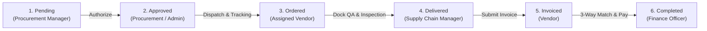

# VendorIQ — Predictive Vendor Intelligence & Supplier Risk Management Platform

[](https://www.python.org/)
[](https://fastapi.tiangolo.com/)
[](https://docs.pytest.org/)
[](https://www.docker.com/)
[](https://www.sqlite.org/)
[](#design-system)

**VendorIQ** is an enterprise-grade full-stack supplier intelligence, automated performance evaluation, and procurement risk management system. It bridges historical supply chain delivery analytics with live warehouse dock receiving workflows, autonomous multi-metric scoring, and role-based access control (RBAC).

---

## Table of Contents
- [Key Features](#key-features)
- [Autonomous Mathematical Scoring Engine](#autonomous-mathematical-scoring-engine)
- [DataCo Supply Chain Dataset Integration](#dataco-supply-chain-dataset-integration)
- [Enterprise Role-Based Access Control (RBAC)](#enterprise-role-based-access-control-rbac)
- [The 6 Canonical Vendors & Credentials](#the-6-canonical-vendors--credentials)
- [Multi-Stage Procurement Lifecycle](#multi-stage-procurement-lifecycle)
- [System Architecture & Codebase Map](#system-architecture--codebase-map)
- [Quick Start Guide](#quick-start-guide)
- [Running Automated Tests](#running-automated-tests)
- [Docker Deployment](#docker-deployment)
- [API Documentation](#api-documentation)

---

## Key Features

- **Strict 6-Category Canonical Supplier Registry:** Exactly 6 audited enterprise vendors, each mapped 1-to-1 to a distinct supply chain category.
- **Dedicated Vendor Portals:** Individual secure logins for all 6 vendors with strict tenant isolation (zero cross-vendor data leakage).
- **Autonomous Multi-Factor Scoring:** Pure mathematical evaluation calculated from actual delivery timestamps, dock quality ratings, turnaround hours, and SLA contracts.
- **Real-World DataCo Dataset Ingestion:** Ingests authentic shipping records from `DataCoSupplyChainDataset.csv` comparing real shipping days against scheduled deadlines.
- **Loading Dock QA Receiving:** Supply Chain Managers conduct physical receiving dock inspections, logging actual arrival dates and 1.0–5.0 quality ratings.
- **3-Way Matching & Invoicing:** Finance Officers reconcile Purchase Orders, Dock QA Inspection Manifests, and Supplier Invoices prior to payment clearance.
- **Interactive Intelligence Scorecards:** Drill-down modal displaying the exact mathematical points, weights, on-time ratios, and risk tiers.

---

## Autonomous Mathematical Scoring Engine

Vendor performance is calculated dynamically by [`backend/app/core/metrics.py`](backend/app/core/metrics.py) using the following weighted mathematical model:

$$\text{Reliability Score} = (0.35 \times D) + (0.30 \times Q) + (0.15 \times R) + (0.20 \times S)$$

### Scoring Metric Breakdown

| Component | Weight | Measured Metric | Calculation Method |
|---|:---:|---|---|
| **Delivery Accuracy ($D$)** | **35%** | On-Time Delivery Rate | $\frac{\text{On-Time Delivered Orders}}{\text{Total Delivered Orders}} \times 100\%$ where $\text{actual\_date} \le \text{expected\_date}$ |
| **Dock Quality QA ($Q$)** | **30%** | Receiving Inspection Score | $\frac{\text{Average QA Rating (1.0 -- 5.0)}}{5.0} \times 100\%$ |
| **Communication Turnaround ($R$)** | **15%** | Response Time in Hours | Scored against enterprise SLA: $\max(15, \min(100, 100 - (\text{hours} - 1.0) \times 10))$ |
| **Contract SLA ($S$)** | **20%** | Legal Compliance Status | `Compliant` = 100%, `Under Review` = 80%, `Expired` = 65%, `None` = 50% |

### Dynamic Risk Tier Classification

- **Low Risk ($\ge 85.0$):** Fully compliant, exceptional on-time fulfillment, Tier-1 preferred vendor.
- **Medium Risk ($70.0 - 84.9$):** Stable performance, standard audit and conditional monitoring.
- **High Risk ($< 70.0$):** Performance drops, expired contracts, or frequent delivery delays triggering automated alerts.

---

## DataCo Supply Chain Dataset Integration

The platform ingests authentic supply chain transactions from `data/DataCoSupplyChainDataset.csv`:
* **Scheduled Timeline:** Extracted from `Days for shipment (scheduled)` $\rightarrow$ sets the PO's `expected_delivery_date`.
* **Actual Timeline:** Extracted from `Days for shipping (real)` $\rightarrow$ sets the PO's `actual_delivery_date`.
* **Ground-Truth On-Time/Late:** Extracted directly from `Late_delivery_risk` ($0$ = On-Time, $1$ = Late) and `Delivery Status` (*Advance shipping*, *Shipping on time*, *Late delivery*).
* **Fulfillment Data:** Sourced directly from `Order Item Total`, `Order Item Quantity`, `Product Name`, `Department Name`, `Shipping Mode`, and `Order City`.

---

## Enterprise Role-Based Access Control (RBAC)

The platform enforces strict role-based access control across 6 organizational personas:

| Role | Primary Responsibilities | Portal Permissions |
|---|---|---|
| **Procurement Manager** | Creates purchase requisitions, onboards suppliers, tracks orders | Full access to POs, Vendors, Requisitions |
| **Supply Chain Manager** | Inspects shipments at loading dock, conducts QA, reviews risk metrics | Dock Receiving (`PATCH /receive`), Metrics Audit |
| **Finance Officer** | Reviews 3-way match, clears invoices, authorizes corporate payments | Invoices, Settlement, Financial Analytics |
| **Auditor** | Independent compliance reviews, contract expiry monitoring, audit trails | Read-only compliance logs, SLAs, Reports |
| **Administrator** | System governance, global user management, recalculation triggers | Full system-wide governance access |
| **Vendor (Supplier)** | Views assigned orders, submits tracking dispatch, submits invoices | Strictly isolated to company's own records |

---

## The 6 Canonical Vendors & Credentials

All 6 canonical categories have exactly 1 certified supplier. Dedicated logins provide 100% data isolation:

| # | Vendor Company | Assigned Category | Headquarters | Login Email | Password |
|---|---|---|---|---|:---:|
| **1** | **Apex Logistics & Supply Co.** | Logistics Partners | Chicago, USA | `apex@vendoriq.com` | `vendor123` |
| **2** | **CoreTech Electronic Systems** | IT Vendors | San Jose, USA | `coretech@vendoriq.com` | `vendor123` |
| **3** | **Global Industrial Raw Materials Corp** | Raw Material Suppliers | Pittsburgh, USA | `global@vendoriq.com` | `vendor123` |
| **4** | **Precision Heavy Equipment Ltd** | Equipment Vendors | Stuttgart, Germany | `precision@vendoriq.com` | `vendor123` |
| **5** | **Vanguard Enterprise Solutions** | Service Providers | Bangalore, India | `vanguard@vendoriq.com` | `vendor123` |
| **6** | **Alliance Facility & Maintenance** | Maintenance Vendors | Dallas, USA | `alliance@vendoriq.com` | `vendor123` |

### Internal Enterprise Staff Credentials

| Role | Name | Login Email | Password |
|---|---|---|:---:|
| **Administrator** | Sarah Jenkins | `admin@vendoriq.com` | `admin123` |
| **Procurement Manager** | David Miller | `procurement@vendoriq.com` | `procure123` |
| **Supply Chain Manager** | Elena Rostova | `supplychain@vendoriq.com` | `supply123` |
| **Finance Officer** | Robert Chen | `finance@vendoriq.com` | `finance123` |
| **Auditor** | Marcus Vance | `auditor@vendoriq.com` | `auditor123` |

> [!TIP]
> **1-Click Login:** The login screen (`index.html`) includes 1-click quick-fill buttons for all 6 internal enterprise roles and all 6 vendor accounts.

---

## Multi-Stage Procurement Lifecycle

Every purchase order progresses through a strictly audited 6-stage lifecycle:



1. **Pending:** Requisition created with Incoterms, delivery address, shipping mode, and budget center.
2. **Approved:** Procurement authorizes purchase order and notifies assigned vendor.
3. **Ordered / In-Transit:** Vendor logs in, attaches carrier tracking number, and dispatches shipment.
4. **Delivered & QA Cleared:** Supply Chain Manager inspects delivery dock crates, stamps `actual_delivery_date`, logs QA rating (1.0–5.0), and triggers autonomous metric recalculation.
5. **Invoiced:** Vendor uploads billing invoice against the verified delivery.
6. **Completed:** Finance Officer executes 3-way match (PO = Dock Receipt = Invoice) and authorizes payment settlement.

---

## System Architecture & Codebase Map

```text
Vendor-Reliability-Intelligence-Platform/
├── backend/
│   ├── app/
│   │   ├── api/v1/endpoints/
│   │   │   ├── analytics.py        # Executive KPI summaries & spend/risk charts
│   │   │   ├── auth.py             # OAuth2 password flow & JWT bearer tokens
│   │   │   ├── contracts.py        # SLA agreements & compliance status
│   │   │   ├── notifications.py    # Real-time multi-role notification alerts
│   │   │   ├── procurement.py      # PO lifecycle, dock QA, & vendor isolation
│   │   │   └── vendors.py          # Supplier registry & metrics breakdown API
│   │   ├── core/
│   │   │   ├── config.py           # Application settings & security secrets
│   │   │   ├── metrics.py          # Mathematical Scoring Engine
│   │   │   └── security.py         # Passlib bcrypt hashing & JWT utilities
│   │   ├── db/
│   │   │   ├── init_db.py          # Database seeding & 6 vendor setup
│   │   │   └── session.py         # SQLAlchemy engine & session factory
│   │   ├── models/                 # SQLAlchemy ORM models (Vendor, PO, User, Contract, etc.)
│   │   ├── schemas/                # Pydantic validation schemas
│   │   ├── tests/                  # Integration & unit test suite (13 passing tests)
│   │   └── main.py                 # FastAPI application factory & static mounting
│   └── scripts/
│       └── ingest_dataco.py        # DataCo dataset ETL & scoring pipeline
├── data/
│   ├── DataCoSupplyChainDataset.csv      # Authentic supply chain shipment records
│   └── DescriptionDataCoSupplyChain.csv # Column definitions & metadata
├── frontend/
│   ├── css/                        # Terracotta & Mocha Brown theme styles
│   ├── js/                         # Auth state, API wrappers, navigation components
│   ├── contracts.html              # Contract SLA management & renewal cockpit
│   ├── dashboard.html              # Executive intelligence dashboard (Chart.js)
│   ├── index.html                  # Slide-to-unlock login with 1-click personas
│   ├── notifications.html          # Role-based notification alert center
│   ├── performance.html            # Vendor benchmarking & scorecard viewer
│   ├── procurement.html            # PO manifest, dock QA receiving modal
│   ├── reports.html                # Audit trails & supplier compliance exports
│   └── vendors.html                # Canonical supplier directory & calculation scorecard
├── docker-compose.yml              # Container orchestration configuration
├── Dockerfile                      # Production container build recipe
└── requirements.txt                # Python backend dependencies
```

---

## Quick Start Guide

### Prerequisites
- Python 3.10+
- Git

### 1. Clone Repository & Setup Virtual Environment
```bash
git clone https://github.com/springboardmentor922-wq/Vendor-Reliability-Intelligence-Platform.git
cd Vendor-Reliability-Intelligence-Platform

# Create and activate virtual environment
python -m venv backend/.venv
# Windows:
backend\.venv\Scripts\activate
# Linux/macOS:
source backend/.venv/bin/activate

# Install dependencies
pip install -r requirements.txt
```

### 2. Ingest Dataset & Initialize Database
```bash
python backend/scripts/ingest_dataco.py
```
*Creates database tables, seeds the 6 canonical vendors and RBAC users, ingests authentic DataCo supply chain transactions, and calculates autonomous reliability scores.*

### 3. Launch Development Server
```bash
uvicorn app.main:app --reload --app-dir backend --port 8080
```
Open **[http://localhost:8080](http://localhost:8080)** in your browser.

---

## Running Automated Tests

Run the full pytest suite:
```bash
pytest backend/app/tests -v
```
**Results:** `13 passed, 0 failed` covering authentication, role-based access control, PO lifecycle transitions, contract enforcement, and analytics summaries.

---

## Docker Deployment

Build and run using Docker Compose:
```bash
docker-compose up --build -d
```
The application will be accessible at `http://localhost:8080`.

---

## API Documentation

Interactive OpenAPI / Swagger documentation is available out of the box:
- **Swagger UI:** [http://localhost:8080/docs](http://localhost:8080/docs)
- **ReDoc:** [http://localhost:8080/redoc](http://localhost:8080/redoc)

### Key Endpoints
| Method | Endpoint | Description |
|---|---|---|
| `POST` | `/api/v1/auth/login` | Authenticate user & return JWT token |
| `GET` | `/api/v1/vendors/` | Fetch vendor list (filtered by role) |
| `GET` | `/api/v1/vendors/{id}/metrics-breakdown` | Exact mathematical scoring breakdown |
| `POST` | `/api/v1/vendors/recalculate-all` | Recalculate scores for all registered vendors |
| `GET` | `/api/v1/procurement/orders` | Fetch POs (tenant-isolated for vendors) |
| `PATCH` | `/api/v1/procurement/orders/{id}/dispatch` | Vendor shipment dispatch & tracking attachment |
| `PATCH` | `/api/v1/procurement/orders/{id}/receive` | Supply Chain dock receiving & QA inspection |
| `PATCH` | `/api/v1/procurement/orders/{id}/invoice` | Submit vendor invoice |
| `POST` | `/api/v1/procurement/orders/{id}/pay` | Finance 3-way match payment clearance |
| `GET` | `/api/v1/analytics/summary` | Executive procurement KPIs |
| `GET` | `/api/v1/analytics/charts` | Spend, delivery trends, and risk distributions |

---

## Design System & Palette

The platform strictly uses the **Terracotta & Mocha Brown** executive design system:
- **Primary Accent:** Terracotta (`#ea580c` / `#c2410c`)
- **Secondary Tone:** Warm Mocha & Slate (`#78350f` / `#334155`)
- **Card Backgrounds:** Glassmorphic Pearl White (`#ffffff` / `#fff7ed`)
- **Typography:** Inter / System UI, high-contrast accessibility standards.

---

## License
Distributed under the MIT License. See `LICENSE` for details.
