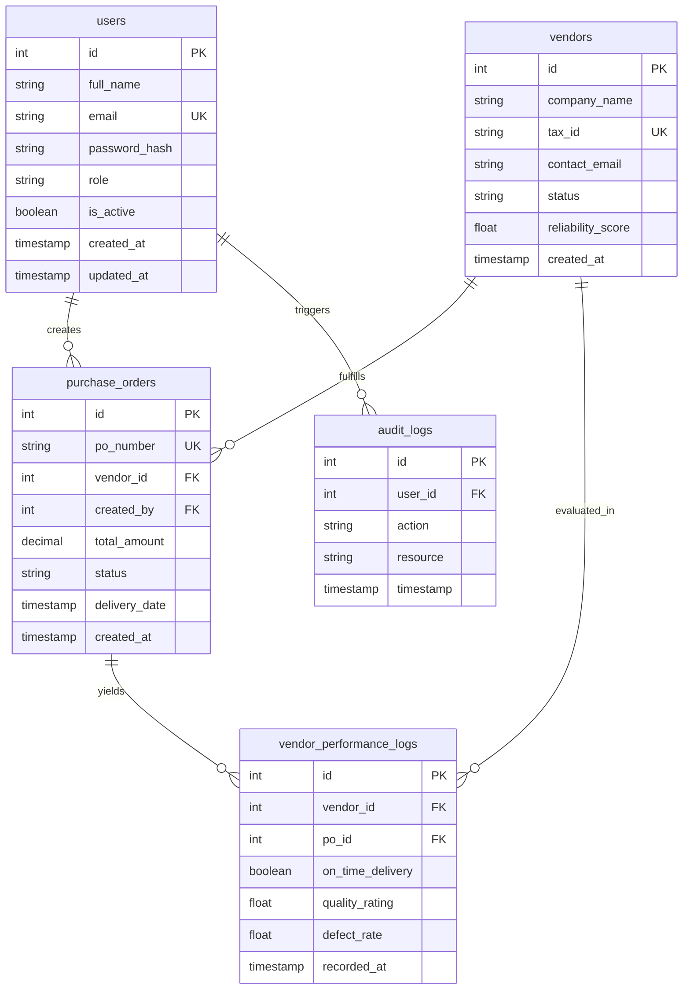

# Entity Relationship (ER) Diagram

## 1. Milestone 1 Implemented Schema & Future System ER Model

> [!NOTE]
> Solid entities (`users`) represent active implemented models in Milestone 1. Dashed/planned entities (`vendors`, `purchase_orders`, `vendor_performance_logs`, `audit_logs`) outline the architectural blueprint for Milestones 2 and 3.
