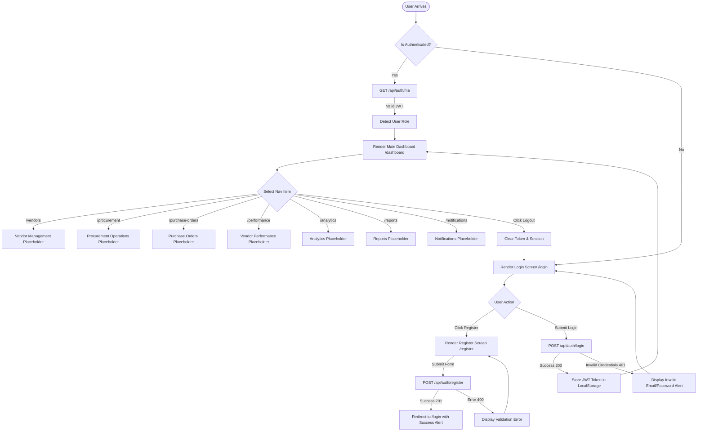

# User Flow & Interaction Documentation

## 1. Authentication & Navigation Flow Diagram

---

## 2. Protected Route Interception Flow

1. User attempts to navigate directly to protected URL (e.g. `/dashboard` or `/vendors`).
2. Angular `authGuard` checks `AuthService.isAuthenticated()`.
3. If token is missing or expired:
   - Route guard cancels navigation.
   - Redirects user to `/login`.
4. If token is valid:
   - HTTP Interceptor automatically attaches `Authorization: Bearer <token>` to outbound API calls.
   - Page loads successfully.
5. If backend returns `401 Unauthorized` during API call:
   - Interceptor catches 401 error.
   - Clears local storage session.
   - Redirects user to `/login` with session expired message.
